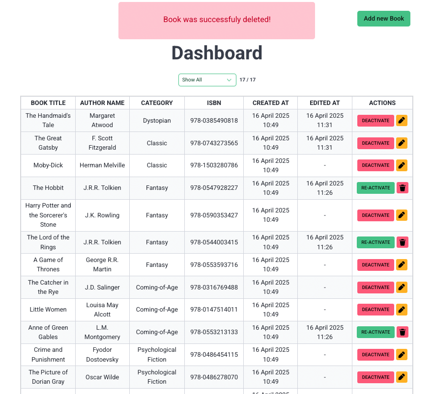

# Books-Table (Frontend + Backend)

A modern web application for managing and viewing book data.

## 📸 Screenshots

<div align="center">
  
  <p><em>Main view with book list</em></p>

  
  <p><em>View with book adding</em></p>

   
  <p><em>View with book editing</em></p>

  
  <p><em>View with form validation</em></p>

  
  <p><em>View with books de../activation</em></p>

  
  <p><em>View with books filtering</em></p>

  
  <p><em>View with notifications</em></p>

</div>

## 🌟 Features

### Frontend

  - Styled by Bulma CSS and custom styles.
  - Fully responsive and mobile-friendly interface.
  - Efficient state handling using Reducers and Dispatch.
  - Universal function for handling API requests, supporting GET, POST, PATCH, and DELETE methods.
  - Error handling and loading states for a smooth user experience.
  - Clean and intuitive design with icon integration for enhanced UX.
  - Deployed on OnRender server for seamless access and scalability.

### Backend

  - Utilizes MongoDB for robust and scalable data storage.
  - RESTful API with universal request handler for efficient data processing.
  - Secure data handling practices to protect user information.
  - Built with Node.js and Express.js for fast and reliable server-side operations.
  - Deployed on OnRender server for reliable backend services.


## 🛠️ Tech Stack

### Frontend

- React
- TypeScript
- SASS
- React Router
- Bulma CSS Framework and a few custom styles
- Context API with Reducer and Dispatch
- Universal function for API requests
- Icon Library FontAwesome

### Backend

- Node.js
- Express.js
- MongoDB for database
- Universal request handler
- Secure and efficient data handling

## 📦 Project Structure

```
frontend/src/
├── components/     # Reusable UI components
├── context/        # React context for state management
├── pages/          # Page components
├── types/          # TypeScript type definitions
├── utils/          # Utility functions
└── api.ts          # API integration

backend/src/
├── controllers/    # API controllers
├── models/         # Database models
├── routes/         # API routes
└── server.js       # Server setup
```

## 🎯 Live Demo

Check out the live version at: [https://books-table.onrender.com](https://books-table.onrender.com)

## 🚀 Getting Started

### Prerequisites

- Node.js (v14 or higher)
- npm (v6 or higher)

### Frontend Setup

1. Clone the repository:

```bash
git clone https://github.com/yourusername/Books-Table.git
cd Books-Table/frontend
```

2. Install dependencies:

```bash
npm install
```

3. Start the development server:

```bash
npm run dev
```

The frontend application will be available at `http://localhost:5173`

### Backend Setup

1. Navigate to the backend directory:

```bash
cd Books-Table/backend
```

2. Install dependencies:

```bash
npm install
```

3. Start the backend server:

```bash
npm start
```

The backend server will be running on the specified port (e.g., `http://localhost:5000`).

### Building for Production

To create a production build for the frontend:

```bash
npm run build
```

### Deployment

The application is deployed to Render. To deploy manually:

```bash
npm run deploy
```
